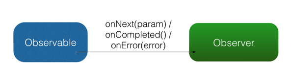

## Rxjava
项目地址：https://github.com/ReactiveX/RxAndroid
# 定义

>基于观察者模式，一个用来实现异步操作的库

# 基本概念 
Rxjava有四个基本概念，分别是Observable (具体目标，即被观察者)、 Observer (观察者)、 subscribe (订阅)、事件。其中observable和observer通过subscribe()实现订阅关系, Observable 可以在需要的时候发出事件来通知 Observer。<br>

 RxJava 的事件回调方有三个：<br>
 1.**onNext()**:普通事件。相当于Onclick()/onEvent()<br>
 2.**onCompleted()**:事件队列完结。RxJava 不仅把每个事件单独处理，还会把它们看做一个队列。RxJava 规定，当不会再有新的 onNext() 发出时，需要触发 onCompleted() 方法作为标志。<br> 
 3.**onError()**：事件队列异常。在事件处理过程中出异常时，onError() 会被触发，同时队列自动终止，不允许再有事件发出。<br>
 **注意**：在一个正确运行的事件序列中, onCompleted() 和 onError() 有且只有一个，并且是事件序列中的最后一个。需要注意的是，onCompleted() 和 onError() 二者也是互斥的，即在队列中调用了其中一个，就不应该再调用另一个。
 
 
# 基本实现
1、创建观察者
```java
Observer<String> observer = new Observer<String>() {    
    @Override    
    public void onNext(String s) {
                Log.d(tag, "Item: " + s);    
                }    
    @Override    
    public void onCompleted() { 
               Log.d(tag, "Completed!");    
    }    
    @Override    
    public void onError(Throwable e) {       
         Log.d(tag, "Error!");   
         }
    };
```
除了 Observer 接口之外，RxJava 还内置了一个实现了 Observer 的抽象类：Subscriber。 Subscriber 对 Observer 接口进行了一些扩展，但他们的基本使用方式是完全一样的：
```java
Subscriber<String> subscriber = new Subscriber<String>()  {
    @Override    
    public void onNext(String s) {        
        Log.d(tag, "Item: " + s);    
        }    
    @Override    
    public void onCompleted() {        
        Log.d(tag, "Completed!");    
        }    
    @Override    
    public void onError(Throwable e) {        
        Log.d(tag, "Error!");    
        }
};              
```
Observer 和 Subscriber 主要有以下两个区别：<br>
1、**onStart()**: 这是 Subscriber 增加的方法。它会在 subscribe 刚开始，而事件还未发送之前被调用，可以用于做一些准备工作，例如数据的清零或重置。这是一个可选方法，默认情况下它的实现为空。需要注意的是，如果对准备工作的线程有要求（例如弹出一个显示进度的对话框，这必须在主线程执行）， onStart() 就不适用了，因为它总是在 subscribe 所发生的线程被调用，而不能指定线程。要在指定的线程来做准备工作，可以使用 doOnSubscribe() 方法，具体可以在后面的文中看到。<br>
2、**unsubscribe()**: 这是 Subscriber 所实现的另一个接口 Subscription 的方法，用于取消订阅。在这个方法被调用后，Subscriber 将不再接收事件。一般在这个方法调用前，可以使用 isUnsubscribed() 先判断一下状态。 unsubscribe() 这个方法很重要，因为在 subscribe() 之后， Observable 会持有 Subscriber 的引用，这个引用如果不能及时被释放，将有内存泄露的风险。所以最好保持一个原则：要在不再使用的时候尽快在合适的地方（例如 onPause() onStop() 等方法中）调用 unsubscribe() 来解除引用关系，以避免内存泄露的发生。