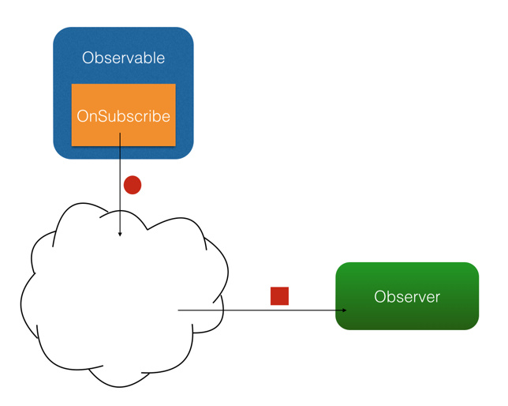
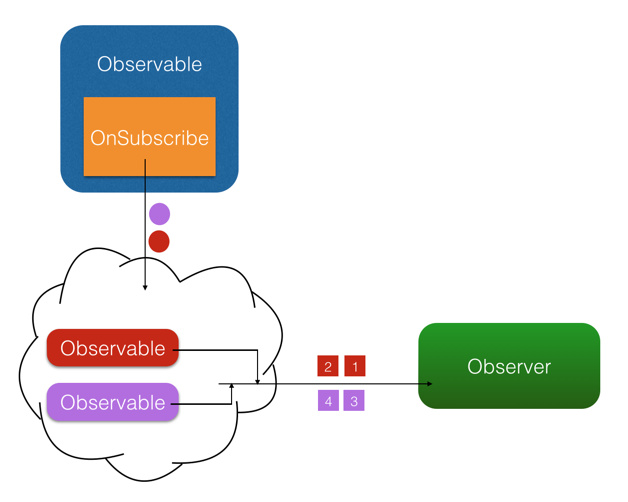
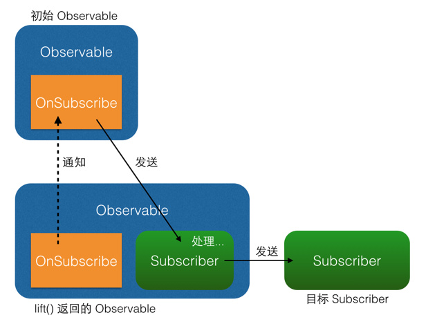

# Rxjava
项目地址：https://github.com/ReactiveX/RxAndroid

- [Rxjava](#rxjava)
  - [定义](#%e5%ae%9a%e4%b9%89)
  - [基本概念](#%e5%9f%ba%e6%9c%ac%e6%a6%82%e5%bf%b5)
    - [四个基本概念](#%e5%9b%9b%e4%b8%aa%e5%9f%ba%e6%9c%ac%e6%a6%82%e5%bf%b5)
    - [事件回调方法](#%e4%ba%8b%e4%bb%b6%e5%9b%9e%e8%b0%83%e6%96%b9%e6%b3%95)
  - [基本实现](#%e5%9f%ba%e6%9c%ac%e5%ae%9e%e7%8e%b0)
    - [创建观察者（Observer/Subscriber）](#%e5%88%9b%e5%bb%ba%e8%a7%82%e5%af%9f%e8%80%85observersubscriber)
    - [创建具体目标（Observable）](#%e5%88%9b%e5%bb%ba%e5%85%b7%e4%bd%93%e7%9b%ae%e6%a0%87observable)
    - [创建订阅（Subscribe）](#%e5%88%9b%e5%bb%ba%e8%ae%a2%e9%98%85subscribe)
    - [简单的同步调用应用举例](#%e7%ae%80%e5%8d%95%e7%9a%84%e5%90%8c%e6%ad%a5%e8%b0%83%e7%94%a8%e5%ba%94%e7%94%a8%e4%b8%be%e4%be%8b)
  - [异步调用](#%e5%bc%82%e6%ad%a5%e8%b0%83%e7%94%a8)
    - [线程控制：Scheduler （一）](#%e7%ba%bf%e7%a8%8b%e6%8e%a7%e5%88%b6scheduler-%e4%b8%80)
      - [API：Schedulers.immediate()、Schedulers.newThread()、Schedulers.computation()、Schedulers.computation()、AndroidSchedulers.mainThread()](#apischedulersimmediateschedulersnewthreadschedulerscomputationschedulerscomputationandroidschedulersmainthread)
      - [生产者和消费者线程（subscribeOn/observeOn）](#%e7%94%9f%e4%ba%a7%e8%80%85%e5%92%8c%e6%b6%88%e8%b4%b9%e8%80%85%e7%ba%bf%e7%a8%8bsubscribeonobserveon)
    - [事件序列变换](#%e4%ba%8b%e4%bb%b6%e5%ba%8f%e5%88%97%e5%8f%98%e6%8d%a2)
      - [常用API：map()、flatMap()、throttleFirst()](#%e5%b8%b8%e7%94%a8apimapflatmapthrottlefirst)
      - [变换的原理：lift()](#%e5%8f%98%e6%8d%a2%e7%9a%84%e5%8e%9f%e7%90%86lift)
    - [对Observable整体的变换(compose)](#%e5%af%b9observable%e6%95%b4%e4%bd%93%e7%9a%84%e5%8f%98%e6%8d%a2compose)
    - [线程控制：Scheduler (二)](#%e7%ba%bf%e7%a8%8b%e6%8e%a7%e5%88%b6scheduler-%e4%ba%8c)
      - [使用observeOn()多次切换线程](#%e4%bd%bf%e7%94%a8observeon%e5%a4%9a%e6%ac%a1%e5%88%87%e6%8d%a2%e7%ba%bf%e7%a8%8b)
  - [RxJava 的适用场景和使用方式](#rxjava-%e7%9a%84%e9%80%82%e7%94%a8%e5%9c%ba%e6%99%af%e5%92%8c%e4%bd%bf%e7%94%a8%e6%96%b9%e5%bc%8f)
    - [与 Retrofit 的结合](#%e4%b8%8e-retrofit-%e7%9a%84%e7%bb%93%e5%90%88)

## 定义

>Rxjava：一个基于观察者模式，用来实现异步操作的库

## 基本概念 
### 四个基本概念
Rxjava有四个基本概念，分别是Observable (具体目标，即被观察者)、 Observer (观察者)、 subscribe (订阅)、事件。其中observable和observer通过subscribe()实现订阅关系, Observable 可以在需要的时候发出事件来通知 Observer。<br>

### 事件回调方法
 RxJava 的事件回调方有三个：<br>
 - **onNext()**:普通事件。相当于Onclick()/onEvent()<br>
 - **onCompleted()**:事件队列完结。RxJava 不仅把每个事件单独处理，还会把它们看做一个队列。RxJava 规定，当不会再有新的 onNext() 发出时，需要触发 onCompleted() 方法作为标志。<br> 
 - **onError()**：事件队列异常。在事件处理过程中出异常时，onError() 会被触发，同时队列自动终止，不允许再有事件发出。<br>
 **注意**：在一个正确运行的事件序列中, onCompleted() 和 onError() 有且只有一个，并且是事件序列中的最后一个。需要注意的是，onCompleted() 和 onError() 二者也是互斥的，即在队列中调用了其中一个，就不应该再调用另一个。
 
 
## 基本实现
### 创建观察者（Observer/Subscriber）
```java
Observer<String> observer = new Observer<String>() {    
    @Override    
    public void onNext(String s) {
                Log.d(tag, "Item: " + s);    
                }    
    @Override    
    public void onCompleted() { 
               Log.d(tag, "Completed!");    
    }    
    @Override    
    public void onError(Throwable e) {       
         Log.d(tag, "Error!");   
         }
    };
```
除了 Observer 接口之外，RxJava 还内置了一个实现了 Observer 的抽象类：Subscriber。 Subscriber 对 Observer 接口进行了一些扩展，但他们的基本使用方式是完全一样的：
```java
Subscriber<String> subscriber = new Subscriber<String>()  {
    @Override    
    public void onNext(String s) {        
        Log.d(tag, "Item: " + s);    
        }    
    @Override    
    public void onCompleted() {        
        Log.d(tag, "Completed!");    
        }    
    @Override    
    public void onError(Throwable e) {        
        Log.d(tag, "Error!");    
        }
};              
```
Observer 和 Subscriber 主要有以下两个区别：<br>
1、**onStart()**: 这是 Subscriber 增加的方法。它会在 subscribe 刚开始，而事件还未发送之前被调用，可以用于做一些准备工作，例如数据的清零或重置。这是一个可选方法，默认情况下它的实现为空。需要注意的是，如果对准备工作的线程有要求（例如弹出一个显示进度的对话框，这必须在主线程执行）， onStart() 就不适用了，因为它总是在 subscribe 所发生的线程被调用，而不能指定线程。要在指定的线程来做准备工作，可以使用 doOnSubscribe() 方法，具体可以在后面的文中看到。<br>
2、**unsubscribe()**: 这是 Subscriber 所实现的另一个接口 Subscription 的方法，用于取消订阅。在这个方法被调用后，Subscriber 将不再接收事件。一般在这个方法调用前，可以使用 isUnsubscribed() 先判断一下状态。 unsubscribe() 这个方法很重要，因为在 subscribe() 之后， Observable 会持有 Subscriber 的引用，这个引用如果不能及时被释放，将有内存泄露的风险。所以最好保持一个原则：要在不再使用的时候尽快在合适的地方（例如 onPause() onStop() 等方法中）调用 unsubscribe() 来解除引用关系，以避免内存泄露的发生。

### 创建具体目标（Observable）
Observable就是观察者模式中的具体目标，即被观察的对象。它决定什么时候触发事件以及触发怎样的事件。<br>
下面的代码中，Rxjava使用Observable的create()方法来创建一个具体目标，并在其中定义了一系列的触发事件。其中包括三个onNext()和一个onCompleted();
```java
Observable observable = Observable.create(
    new Observable.OnSubscribe<String>() {    
        @Override    
        public void call(Subscriber<? super String> subscriber){
            subscriber.onNext("Hello");        
            subscriber.onNext("Hi");        
            subscriber.onNext("Aloha");        
            subscriber.onCompleted();    
        }
    });
```
OnSubscribe作为参数被传进create()创建方法中，此时observable对象中就存储了这个事件列表，当observable被订阅之后，OnSubscribe的call方法就会被调用，对观察者进行通知，观察者Subscriber的事件列表中的事件会被一次调用。这样就实现了从目标向观察者进行事件传递。这段代码本身没有什么意义，但是能够说明Rxjava的实现方式。<br>
除了create()方法,RxJava 还提供了一些方法用来快捷创建事件队列:<br>
1. **just(T...)**:
   ```java
    Observable observable = Observable.just("Hello", "Hi", "Aloha");
    // 将会依次调用：
    // onNext("Hello");
    // onNext("Hi");
    // onNext("Aloha");
    // onCompleted();
   ```
2. **from(T[])/from(Iterable<? extends T>)** 将传入的数组或 Iterable 拆分成具体对象后，依次发送出来:
   ```java
   String[] words = {"Hello", "Hi", "Aloha"};
   Observable observable = Observable.from(words);
   // 将会依次调用：
   // onNext("Hello");
   // onNext("Hi");
   // onNext("Aloha");
   // onCompleted();
   ```

###  创建订阅（Subscribe）
创建了 **Observable** 和 **Observer** 之后，再用 **subscribe**() 方法来实现观察者对目标的订阅。
```java
//observer订阅了observable
observable.subscribe(observer);
//另一种写法
observable.subscribe(subscriber);
```
`observable.subscribe(observer)`内部主要进行了以下操作：
1. 调用 Subscriber.onStart() ,进行事件调用之前的准备工作，默认是空。
2. 调用 Observable 中的 OnSubscribe.call(Subscriber) 。在这里，事件发送的逻辑开始运行。从这也可以看出，在 RxJava 中， Observable 并不是在创建的时候就立即开始发送事件，而是在它被订阅的时候，即当 subscribe() 方法执行的时候。
3. 将传入的 观察者Subscriber 作为 Subscription 返回。这是为了方便进行 unsubscribe()取消订阅。


除了 subscribe(Observer) 和 subscribe(Subscriber) ，subscribe() 还支持不完整定义的回调，RxJava 会自动根据定义创建出 Subscriber 。形式如下：
```java
Action1<String> onNextAction = new Action1<String>() {    
    // onNext()    
        @Override    
        public void call(String s) {      
            Log.d(tag, s);   
            }
};
Action1<Throwable> onErrorAction = new Action1<Throwable>() {    
    // onError()    
    @Override    public void call(Throwable throwable) {        
        // Error handling    
        }
};
Action0 onCompletedAction = new Action0() {    
    // onCompleted()    
    @Override    public void call() {        
        Log.d(tag, "completed");    
        }
};
// 自动创建 Subscriber ，并使用 onNextAction 来定义 onNext()
observable.subscribe(onNextAction);
// 自动创建 Subscriber ，并使用 onNextAction 和 onErrorAction 来定义 onNext() 和 onError()
observable.subscribe(onNextAction, onErrorAction);
// 自动创建 Subscriber ，并使用 onNextAction、 onErrorAction 和 onCompletedAction 来定义 onNext()、 onError() 和 onCompleted()
observable.subscribe(onNextAction, onErrorAction, onCompletedAction);
```
这段代码中出现的 Action1 和 Action0都是RxJava的接口。 <br>
- **Action0** 是 RxJava 的一个接口，它只有一个方法 call()，这个方法是无参无返回值的；由于 onCompleted() 方法也是无参无返回值的，因此 Action0 可以被当成一个包装对象，将 onCompleted() 的内容打包起来将自己作为一个参数传入 subscribe() 以实现不完整定义的回调。这样其实也可以看做将 onCompleted() 方法作为参数传进了 subscribe()，相当于其他某些语言中的『闭包』。 <br>
- **Action1** 也是一个接口，它同样只有一个方法 call(T param)，这个方法也无返回值，但有一个参数；与 Action0 同理，由于 onNext(T obj) 和 onError(Throwable error) 也是单参数无返回值的，因此 Action1 可以将 onNext(obj) 和 onError(error) 打包起来传入 subscribe() 以实现不完整定义的回调。事实上，虽然 Action0 和 Action1 在 API 中使用最广泛，但 RxJava 是提供了多个 ActionX 形式的接口 (例如 Action2, Action3) 的，它们可以被用以包装不同的无返回值的方法。

### 简单的同步调用应用举例

1. 打印字符串数组<br>
   将字符串数组 names 中的所有字符串依次打印出来：
   ```java
   String[] names = ...;
   Observable.from(names).subscribe(new Action1<String>() {  
             @Override        
             public void call(String name) {
                        Log.d(tag, name);        
            }    
        });

   ```
2. 由id取得图片并显示<br>
   由指定的一个 drawable 文件 id drawableRes 取得图片，并显示在 ImageView 中，并在出现异常的时候打印 Toast 报错：
   ```java
   int drawableRes = ...;
   ImageView imageView = ...;
   Observable.create(new OnSubscribe<Drawable>() {    
                    @Override    
                    public void call(Subscriber<? super Drawable> subscriber){        
                        Drawable drawable = getTheme().getDrawable(drawableRes)); 
                        subscriber.onNext(drawable);        
                        subscriber.onCompleted();    
                        }})
           .subscribe(new Observer<Drawable>() {
                   @Override    
                   public void onNext(Drawable drawable) {        
                       imageView.setImageDrawable(drawable);    
                       }    
                    @Override    
                    public void onCompleted() {    }    
                    @Override    
                    public void onError(Throwable e) {        
                        Toast.makeText(activity, "Error!", Toast.LENGTH_SHORT).show();    
                        }
                    });

   ```
以上两个例子展示了如何创建出 Observable 和 Subscriber ，再用 subscribe()完成订阅关联。一次Rxjava的基本使用就是这个样子。但是事件的发出（call方法被调用）和消费（onNext等事件列表被运行）在同一个线程中，这是一个同步的观察者模式，并没有展现Rxjava异步调用的精髓。『后台处理，前台回调』的异步机制才是Rxjava中最重要的机制，而要实现异步，则需要用到 RxJava 的另一个概念： **Scheduler** 。

## 异步调用

### 线程控制：Scheduler （一）
在不指定线程的情况下， RxJava 遵循的是线程不变的原则，即：在哪个线程调用 subscribe()，就在哪个线程生产事件；在哪个线程生产事件，就在哪个线程消费事件。如果需要切换线程，就需要用到 Scheduler （调度器）。<br>

#### API：Schedulers.immediate()、Schedulers.newThread()、Schedulers.computation()、Schedulers.computation()、AndroidSchedulers.mainThread()
在RxJava 中，**Scheduler** 调度器，相当于线程控制器，RxJava 通过它来指定每一段代码应该运行在什么样的线程。RxJava 已经内置了几个 Scheduler ，它们已经适合大多数的使用场景：
- **Schedulers.immediate():** 直接在当前线程运行，相当于不指定线程。这是默认的 Scheduler。
- **Schedulers.newThread():** 总是启用新线程，并在新线程执行操作。
- **Schedulers.io():** I/O 操作（读写文件、读写数据库、网络信息交互等）所使用的 Scheduler。行为模式和 newThread() 差不多，区别在于 io() 的内部实现是是用一个无数量上限的线程池，可以重用空闲的线程，因此多数情况下 io() 比 newThread() 更有效率。不要把计算工作放在 io() 中，可以避免创建不必要的线程。
- **Schedulers.computation():** 计算所使用的 Scheduler。这个计算指的是 CPU 密集型计算，即不会被 I/O 等操作限制性能的操作，例如图形的计算。这个 Scheduler 使用的固定的线程池，大小为 CPU 核数。不要把 I/O 操作放在 computation() 中，否则 I/O 操作的等待时间会浪费 CPU。
- **AndroidSchedulers.mainThread():** Android专用的线程，指的是在Android的UI线程（主线程）中运行。

#### 生产者和消费者线程（subscribeOn/observeOn）
有了这几个 Scheduler ，就可以使用 subscribeOn() 和 observeOn() 两个方法来对线程进行控制了。
* **subscribeOn()**: 指定 subscribe() 所发生的线程，即 Observable.OnSubscribe 被激活时所处的线程。或者叫做事件产生的线程。
* **observeOn()**: 指定 Subscriber 所运行在的线程。或者叫做事件消费的线程。<br>

举个例子:在android中，当需要取出一些图片，并显示在页面上时，可以将加载图片的操作放在io线程中，将图片显示的操作放在主线程中。这意味着加载图片耗费了几十甚至几百毫秒的时间，也不会造成丝毫界面的卡顿。
```java
int drawableRes = ...;
ImageView imageView = ...;
Observable.create(new OnSubscribe<Drawable>() {    
    @Override    
    public void call(Subscriber<? super Drawable> subscriber) {        
        Drawable drawable = getTheme().getDrawable(drawableRes));        subscriber.onNext(drawable);        
        subscriber.onCompleted();    }
        })
        .subscribeOn(Schedulers.io()) // 指定 subscribe() 发生在 IO 线程
        .observeOn(AndroidSchedulers.mainThread()) // 指定 Subscriber 的回调发生在主线程
        .subscribe(new Observer<Drawable>() {    
            @Override    
            public void onNext(Drawable drawable) {        
                imageView.setImageDrawable(drawable);    
            }    
            @Override    
            public void onCompleted() {    }    
            @Override    
            public void onError(Throwable e) {        
                Toast.makeText(activity, "Error!", Toast.LENGTH_SHORT).show();    
            }
        });
```
### 事件序列变换
>将事件序列中的对象或整个序列进行加工处理，转换成不同的事件或事件序列。

#### 常用API：map()、flatMap()、throttleFirst()

- **map()**：将事件对象进行直接变换。<br>
  
  下面例子使用map()方法通过创建了一个返回值的Func1类，修改了从目标对象到观察者之间传递的参数内容,将String转换成了Bitmap。<br>
```java
Observable.just("images/logo.png") // 输入类型 String    
            .map(new Func1<String, Bitmap>() {        
                @Override        
                public Bitmap call(String filePath) { // 参数类型 String            
                return getBitmapFromPath(filePath); // 返回类型 Bitmap        
                }    
            })    
            .subscribe(new Action1<Bitmap>() {        
                @Override        
                public void call(Bitmap bitmap) { // 参数类型 Bitmap            
                showBitmap(bitmap);        
            }    
    });
```
这里出现了一个叫做 **Func1** 的类。它和 **Action1** 非常相似，也是 RxJava 的一个接口，用于包装含有一个参数的方法。 **Func1** 和 **Action** 的区别在于， **Func1** 包装的是有返回值的方法。另外，和 **ActionX** 一样， **FuncX** 也有多个，用于不同参数个数的方法。**FuncX** 和 **ActionX** 的区别在 **FuncX** 包装的是有返回值的方法。
- **flatmap()**:这是一个很有用但非常难理解的变换，因此我决定花多些篇幅来介绍它。首先假设这么一种需求：假设有一个数据结构『学生』，现在需要打印出一组学生的名字。实现方式很简单
```java
Student[] students = ...;
Subscriber<String> subscriber = new Subscriber<String>() {    
    @Override    
    public void onNext(String name) {        
        Log.d(tag, name);    
        }    
        ...
    };
Observable.from(students)    
        .map(new Func1<Student, String>() {        
            @Override        
            public String call(Student student) {            
                return student.getName();        
                }    
            })    
        .subscribe(subscriber);
```
那么再假设：如果要打印出每个学生所需要修的所有课程的名称呢？（需求的区别在于，每个学生只有一个名字，但却有多个课程。）首先可以这样实现：
```java
Student[] students = ...;
Subscriber<Student> subscriber = new Subscriber<Student>() {    
    @Override    
    public void onNext(Student student) {       
         List<Course> courses = student.getCourses();        
         for (int i = 0; i < courses.size(); i++) {            
             Course course = courses.get(i);            
             Log.d(tag, course.getName());        
        }    
    }    
    ...
    };
    Observable.from(students).subscribe(subscriber);
```
那么如果我不想在 Subscriber 中使用 for 循环，而是希望 Subscriber 中直接传入单个的 Course 对象呢（这对于代码复用很重要）？用 **map()** 显然是不行的，因为 **map()** 是一对一的转化，而我现在的要求是一对多的转化。那怎么才能把一个 Student 转化成多个 Course 呢？

这个时候，就需要用 **flatMap()** 了：
```java
Student[] students = ...;
Subscriber<Course> subscriber = new Subscriber<Course>() {    
    @Override    
    public void onNext(Course course) {        
        Log.d(tag, course.getName());    
        }    
        ...
};
Observable.from(students).flatMap(new Func1<Student, Observable<Course>>() {  
          @Override        
          public Observable<Course> call(Student student) {            
            return Observable.from(student.getCourses());        
            }    
})    
.subscribe(subscriber);

```
**flatMap()** 中返回的是个 **Observable** 对象，并且这个 **Observable** 对象并不是被直接发送到了 **Subscriber** 的回调方法中。 **flatMap()** 的原理是这样的：
1. 使用传入的事件对象创建一个 **Observable** 对象；
2. 并不发送这个 **Observable**, 而是将它激活，于是它开始发送事件；
3. 每一个创建出来的 **Observable** 发送的事件，都被汇入同一个 **Observable** ，而这个 **Observable** 负责将这些事件统一交给 **Subscriber** 的回调方法。<br>
   
这三个步骤，把事件拆成了两级，通过一组新创建的 **Observable** 将初始的对象『铺平』之后通过统一路径分发了下去。而这个『铺平』就是 **flatMap()** 所谓的 **flat。**


由于可以在嵌套的 Observable 中添加异步代码， flatMap() 也常用于嵌套的异步操作，例如嵌套的网络请求。示例代码（Retrofit + RxJava）：
```java
networkClient.token() // 返回 Observable<String>，在订阅时请求 token，并在响应后发送 token    
.flatMap(new Func1<String, Observable<Messages>>() {        
    @Override        
        public Observable<Messages> call(String token) {// 返回 Observable<Messages>，在订阅时请求消息列表，并在响应后发送请求到的消息列表            
        return networkClient.messages();        
        }    
    })    
    .subscribe(new Action1<Messages>() {        
        @Override        
        public void call(Messages messages) {            // 处理显示消息列表   
                 showMessages(messages);        
                 }    
    });
```

- **throttleFirst()**: 在每次事件触发后的一定时间间隔内丢弃新的事件。例如防止手抖进行双击打开两个相同的界面等。
  ```java
  RxView.clickEvents(button) // RxBinding 代码
  .throttleFirst(500, TimeUnit.MILLISECONDS) // 设置防抖间隔为 500ms
  .subscribe(subscriber);
  ```

#### 变换的原理：lift()

变换的原理总结来说就是**针对事件序列的处理和再发送**。
在 RxJava 的内部，它们是基于同一个基础的变换方法： **lift(Operator)**。首先看一下 lift() 的内部实现（仅核心代码）：
```java
// 注意：这不是 lift() 的源码，而是将源码中与性能、兼容性、扩展性有关的代码剔除后的核心代码。// 如果需要看源码，可以去 RxJava 的 GitHub 仓库下载。
public <R> Observable<R> lift(Operator<? extends R, ? super T> operator) {    
    return Observable.create(new OnSubscribe<R>() {        
        @Override        
        public void call(Subscriber subscriber) {            
            Subscriber newSubscriber = operator.call(subscriber);                       
            newSubscriber.onStart();  
            onSubscribe.call(newSubscriber);        
            }    
            });
}
```
当含有 lift() 时： 
1. lift() 创建了一个 Observable 后，加上之前的原始 Observable，已经有两个 Observable 了； 
2. 而同样地，新 Observable 里的新 OnSubscribe 加上之前的原始 Observable 中的原始 OnSubscribe，也就有了两个 OnSubscribe； 
3. 当用户调用经过 lift() 后的 Observable 的 subscribe() 的时候，使用的是 lift() 所返回的新的 Observable ，于是它所触发的 onSubscribe.call(subscriber)，也是用的新 Observable 中的新 OnSubscribe，即在 lift() 中生成的那个 OnSubscribe； 
4. 而这个新 OnSubscribe 的 call() 方法中的 onSubscribe ，就是指的原始 Observable 中的原始 OnSubscribe ，在这个 call() 方法里，新 OnSubscribe 利用 operator.call(subscriber) 生成了一个新的 Subscriber（Operator 就是在这里，通过自己的 call() 方法将新 Subscriber 和原始 Subscriber 进行关联，并插入自己的『变换』代码以实现变换），然后利用这个新 Subscriber 向原始 Observable 进行订阅。 
这样就实现了 lift() 过程，有点像一种**代理机制，通过事件拦截和处理实现事件序列的变换**。

在 Observable 执行了 lift(Operator) 方法之后，会返回一个新的 Observable，这个新的 Observable 会像一个代理一样，负责接收原始的 Observable 发出的事件，并在处理后发送给 Subscriber。<br>

图解变换原理lift():
<br>
变换原理lift()动图:
<br>
多重lift():
<br>

>RxJava 不建议开发者自定义 Operator 来直接使用 lift()，而是建议尽量使用已有的 lift() 包装方法（如 map() flatMap() 等）进行组合来实现需求，因为直接使用 lift() 非常容易发生一些难以发现的错误。

### 对Observable整体的变换(compose)

除了 lift() 之外， Observable 还有一个变换方法叫做 compose(Transformer)。它和 lift() 的区别在于， lift() 是针对事件项和事件序列的，而 compose() 是针对 Observable 自身进行变换。
假设在程序中有多个 Observable ，并且他们都需要应用一组相同的 lift() 变换。你可以这么写：
```java
private Observable liftAll(Observable observable) {    
    return observable.lift1()
    .lift2()
    .lift3()
    .lift4();
    }
    ...
    liftAll(observable1).subscribe(subscriber1);
    liftAll(observable2).subscribe(subscriber2);
    liftAll(observable3).subscribe(subscriber3);
    liftAll(observable4).subscribe(subscriber4);
```

当使用Transformer时，代码可以如下写：
```java
public class LiftAllTransformer implements Observable.Transformer<Integer, String> {    
    @Override    
    public Observable<String> call(Observable<Integer> observable) {  
              return observable.lift1().lift2().lift3().lift4();    
        }
    }
    ...
    Transformer liftAll = new LiftAllTransformer();
    observable1.compose(liftAll).subscribe(subscriber1);
    observable2.compose(liftAll).subscribe(subscriber2);
    observable3.compose(liftAll).subscribe(subscriber3);
    observable4.compose(liftAll).subscribe(subscriber4);
```
### 线程控制：Scheduler (二)

#### 使用observeOn()多次切换线程
 使用subscribeOn() 结合 observeOn() 来实现线程控制，让事件的产生和消费发生在不同的线程。在结合了map()等变换方法之后，可以多次的切换线程。
 准确的说，observeOn() 指定的是它之后的操作所在的线程。因此如果有多次切换线程的需求，只要在每个想要切换线程的位置调用一次 observeOn() 即可
 ```java
 Observable.just(1, 2, 3, 4) // IO 线程，由 subscribeOn() 指定    
 .subscribeOn(Schedulers.io())    
 .observeOn(Schedulers.newThread())    
 .map(mapOperator) // 新线程，由 observeOn() 指定    
 .observeOn(Schedulers.io())    
 .map(mapOperator2) // IO 线程，由 observeOn() 指定    
 .observeOn(AndroidSchedulers.mainThread)     
 .subscribe(subscriber);  // Android 主线程，由 observeOn() 指定
 ```
需要注意，不同于 observeOn() ，可以多次切换线程。subscribeOn() 的位置放在哪里都可以，但它是只能调用一次的。

## RxJava 的适用场景和使用方式

### 与 Retrofit 的结合
Retrofit 把请求封装进 Observable ，在请求结束后调用 onNext() 或在请求失败后调用 onError()<br>
请求封装进 Observable：
```java
@GET("/user")public Observable<User> getUser(@Query("userId") String userId);
```
请求调用结束后，调用观察者的方法：
```java
getUser(userId)    
.observeOn(AndroidSchedulers.mainThread())    
.subscribe(new Observer<User>() {        
    @Override        
    public void onNext(User user) {            
        userView.setUser(user);        
    }        
    @Override        
    public void onCompleted() {        }        
    @Override        
    public void onError(Throwable error) {            
        // Error handling            ...        
        }    
    });
```
当请求到User之后，还要与数据库进行修正时,因为数据库的操作很重，一次读写操作花费 10~20ms 是很常见的，这样的耗时很容易造成界面的卡顿。所以通常情况下，如果可以的话一定要避免在主线程中处理数据库：
```java
getUser(userId)    
.doOnNext(new Action1<User>() {        
    @Override        
    public void call(User user) {            
        processUser(user);        
        })    
        .observeOn(AndroidSchedulers.mainThread())    
        .subscribe(new Observer<User>() {        
            @Override        
            public void onNext(User user) {            
                userView.setUser(user);        
                }        
            @Override        
            public void onCompleted() {        }        
            @Override        public void onError(Throwable error) {            
                // Error handling            ...        
            }    });
```
假设 /user 接口并不能直接访问，而需要填入一个在线获取的 token ，代码应该怎么写？
```java
@GET("/token")public Observable<String> getToken();
@GET("/user")public Observable<User> getUser(@Query("token") String token, @Query("userId") String userId);
...
getToken()    
.flatMap(new Func1<String, Observable<User>>() {        
    @Override        
    public Observable<User> onNext(String token) {            
        return getUser(token, userId);        
    })    
.observeOn(AndroidSchedulers.mainThread())    
.subscribe(new Observer<User>() {        
    @Override        
    public void onNext(User user) {            
        userView.setUser(user);        
        }        
    @Override        
    public void onCompleted() {        }        
    @Override        
    public void onError(Throwable error) {            
        // Error handling            ...        
    }    
});

```

