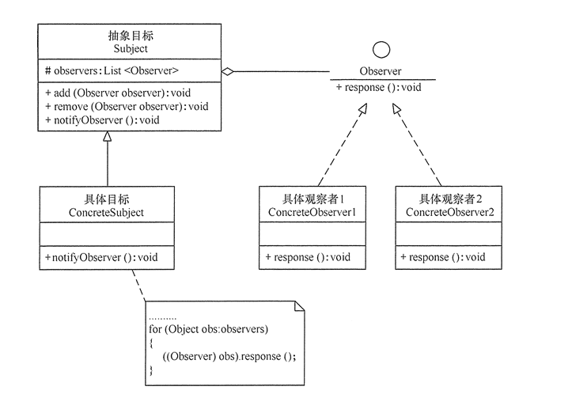

# 观察者模式
- [观察者模式](#%e8%a7%82%e5%af%9f%e8%80%85%e6%a8%a1%e5%bc%8f)
  - [基本概念](#%e5%9f%ba%e6%9c%ac%e6%a6%82%e5%bf%b5)
  - [优点](#%e4%bc%98%e7%82%b9)
  - [缺点](#%e7%bc%ba%e7%82%b9)
  - [模式结构](#%e6%a8%a1%e5%bc%8f%e7%bb%93%e6%9e%84)
  - [代码实现](#%e4%bb%a3%e7%a0%81%e5%ae%9e%e7%8e%b0)
  - [应用实例](#%e5%ba%94%e7%94%a8%e5%ae%9e%e4%be%8b)
    - [微信公众号](#%e5%be%ae%e4%bf%a1%e5%85%ac%e4%bc%97%e5%8f%b7)

## 基本概念

>观察者模式是23中设计模式中的一种（也被称为发布-订阅模式 Publish/Subscribe模式），属于行为型模式。它定义了一种一对多的依赖关系，让多个观察者对象同事监听某一个主题对象。当主题对象的状态发生变化时，会通知所有的观察者对象，让其自动进行更新。

实现观察者模式时要注意**具体目标对象和具体观察者对象之间不能直接调用**，否则将使两者之间紧密耦合起来，这违反了面向对象的设计原则。


## 优点

1、降低了目标与观察者之间的耦合关系，两者之间是抽象耦合关系。<br>
2、目标与观察者之间建立了一套触发机制。

## 缺点

1、目标与观察者之间的依赖关系并没有完全解除，而且有可能出现循环引用。<br>
2、当观察者对象很多时，通知的发布会花费很多时间，影响程序的效率。

## 模式结构

观察者模式主要包含以下角色：<br>
1、抽象目标类（Subject）：提供了一个用于保存观察者对象的聚集类，以及增加和删除观察者、通知观察者的抽象方法。<br>
2、具体目标类（ConcreteSubject）：实现了抽象目标类中的通知方法，当具体目标类内部的状态发生改变的时候，通知所有注册过的观察者对象。<br>
3、抽象观察者（Observer）：这是一个抽象类或者接口，包含了一个更新自己的抽象方法，当接到具体目标的更新通知时调用此方法。<br>
4、具体观察者（Concrete Observer）：实现抽象观察者中定义的抽象方法，以便在得到目标更改通知时更新自身的状态。<br>

观察者模式结构图：


## 代码实现

```java

public class ObserverPattern{
    public static void main(String args[]){

        Subject subject = new ConcreteSubject();//创建具体目标类
        Observer obs1=new ConcreteObserver1();//创建具体观察者1
        Observer obs2=new ConcreteObserver2();//创建具体观察者2
        subject.add(obs1);//将具体观察者1添加到观察者对象聚集类
        subject.add(obs2);//将具体观察者2添加到观察者对象聚集类
        subject.notifyObserver();//通知观察者
    }
}

//抽象目标
abstract class Subject
{
    protected List<Observer> observers=new ArrayList<Observer>();   
    //增加观察者方法
    public void add(Observer observer)
    {
        observers.add(observer);
    }    
    //删除观察者方法
    public void remove(Observer observer)
    {
        observers.remove(observer);
    }   
    public abstract void notifyObserver(); //通知观察者方法
}

//具体目标
class ConcreteSubject extends Subject
{
    public void notifyObserver()
    {
        System.out.println("具体目标发生改变...");
        System.out.println("--------------");       
       
        for(Object obs:observers)
        {
            ((Observer)obs).response();
        }
       
    }          
}

//抽象观察者
interface Observer
{
    void response(); //反应
}
//具体观察者1
class ConcreteObserver1 implements Observer
{
    public void response()
    {
        System.out.println("具体观察者1作出反应！");
    }
}
//具体观察者1
class ConcreteObserver2 implements Observer
{
    public void response()
    {
        System.out.println("具体观察者2作出反应！");
    }
}

```

## 应用实例

### 微信公众号

观察者模式这种发布-订阅的形式，很像我们生活中常用的微信公众号。在微信公众号的使用上，普通的微信用户就是观察者，而微信公众号是目标。当目标更新时，所有的观察者都会收到通知。<br>

**抽象观察者**（Observer）
抽象观察者是一个接口，其中定义了一个更新方法：
```java
public interface Observer{
    public void update(String message);
}
```

**具体观察者**（ConcrereObserver）
在这个例子中，微信用户是具体观察者，implements了抽象观察者这个接口，在里面实现了更新的具体内容：
```java
public class WeixinUser implements Observer{
    private String name;
    public WeixinUser(String name){
        this.name = name;
    }
    @Override
    public void update(String message){
        System.out.println(name+"-"+message);
    }
}
```

**抽象目标**（Subject）
抽象目标是个接口，里面提供了 attach、detach、notify三个方法：
```java
public interface Subject{
    /**
    *增加订阅者
    *@param observer
    */
    public void attach(Observer observer);
    /**
    *删除订阅者
    *@param observer
    */
    public void detach(Observer observer);
    /**
    *通知订阅者更新消息
    *@param observer
    */
    public void notify(String message);
}
```

**具体目标**（ConcreteSubject）
在这个例子中，微信公众号是具体目标（具体主题），里面存储了订阅该公众号的微信用户名单，并实现了抽象目标接口中的三个方法：
```java
public class SubscriptionSubject implements Subject{
    //存储订阅公众号的微信用户
    private List<Observer> weixinUserList = new ArrayList<Observer>();

    @Override
    public void attach(Observer observer){
        weixinUserList.add(observer);
    }

    @Override
    public void  detach(Observer observer){
        weixinUserList.remove(observer);
    }
    @Override
    public void notify(String message){
        for(Observer ob:weixinUserList){
            ob.update(message);
        }
    }
}
```

客户端
```java
public class client{
    public static void main(String args[]){
        //创建微信公众号
        SubscriptionSubject mSubscriptionSubject = new SubscriptionSubject();
        //创建微信用户
        WeixinUser weixinUser1 = new WeixinUser("张三");
        WeixinUser weixinUser2 = new WeixinUser("李四");
        //订阅公众号
        mSubscriptionSubject.add(weixinUser1);
        mSubscriptionSubject.add(weixinUser2);
        //公众号更新，发送通知
        mSubscriptionSubject.notify("公众号更新了");
    }
}
```

运行结果：
>张三--公众号更新了<br>
李四--公众号更新了
